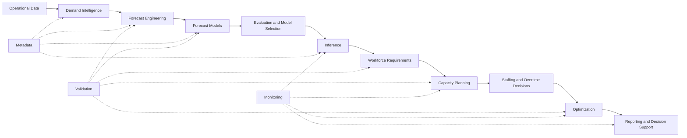
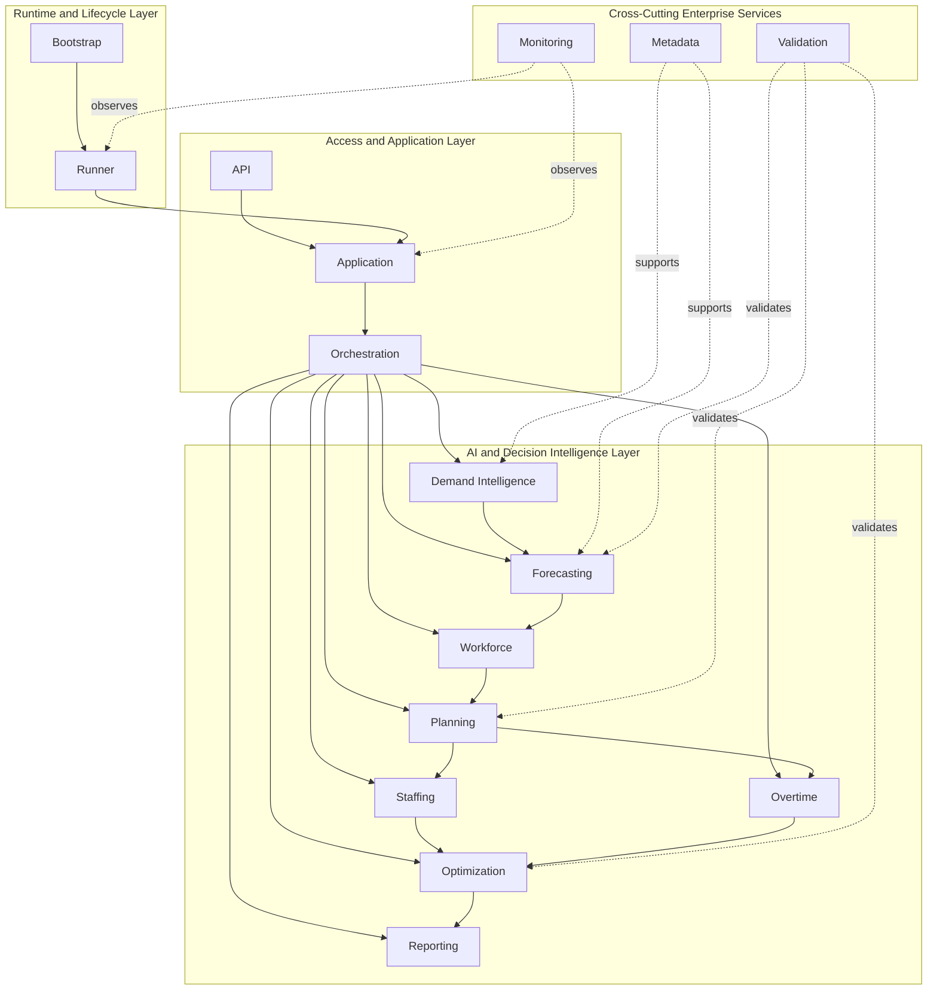
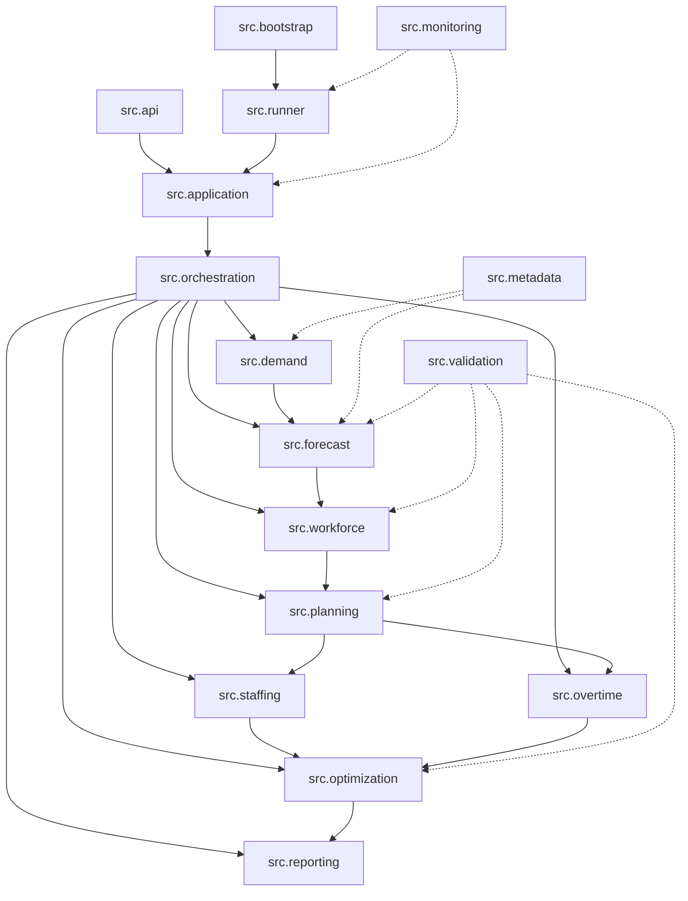
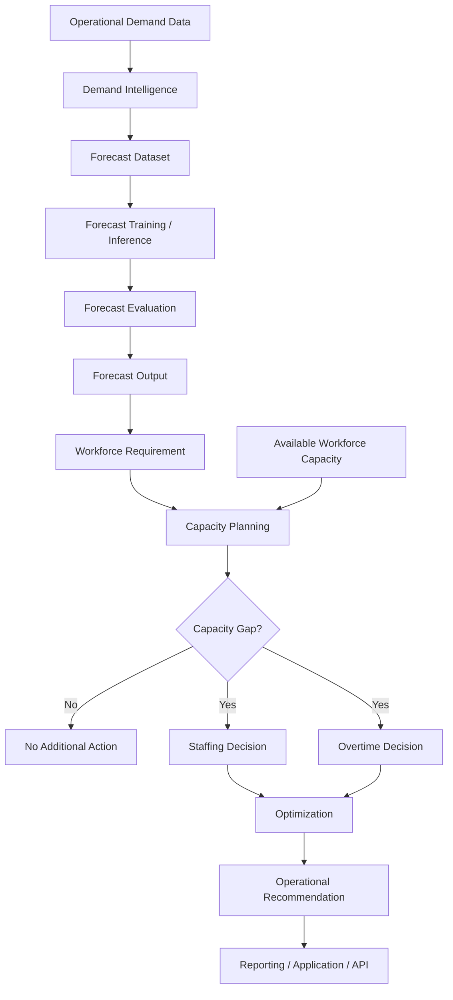

# AI Workforce Capacity Planning Platform

# Platform Architecture

**Version:** 3.0.0  
**Status:** Production Release  
**Architecture Baseline:** Enterprise Production Architecture

---

# 1. Executive Summary

The **AI Workforce Capacity Planning Platform** is a production-quality enterprise AI platform designed to transform operational demand data into explainable workforce planning and decision intelligence.

The platform supports the complete decision lifecycle:

**Operational Demand → Forecasting → Workforce Requirements → Capacity Planning → Staffing and Overtime Decisions → Optimization → Reporting and Operational Decision Support**

Rather than implementing forecasting and workforce planning as a collection of independent notebooks, the platform uses a modular Python package architecture with explicit domain boundaries, reusable services, validation contracts, lifecycle management, observability, and enterprise composition.

Databricks provides the primary development and execution environment while the core architecture remains Python-native and modular.

The v3.0.0 production baseline consists of sixteen canonical packages under the `src` namespace.

---

# 2. Architectural Objectives

The architecture was designed around the following engineering objectives:

- Separation of concerns
- Explicit domain boundaries
- High cohesion
- Low coupling
- Reusable Python components
- Deterministic execution
- Independent package validation
- Explainable decision logic
- Operational observability
- Enterprise maintainability
- Extensible forecasting architecture
- Testable public interfaces
- Controlled dependency boundaries
- Production-oriented lifecycle management

The architecture intentionally separates:

1. business intelligence,
2. decision intelligence,
3. application composition,
4. runtime execution, and
5. cross-cutting enterprise services.

---

# 3. Enterprise System Context

The platform converts operational demand signals into workforce decisions.

At the highest level:



This architecture separates predictive intelligence from operational decision intelligence.

Forecasting answers:

> **What workload is expected?**

Workforce modeling answers:

> **What workforce capacity is required?**

Planning answers:

> **Is available capacity sufficient?**

Staffing and overtime decision services answer:

> **What workforce action should be considered?**

Optimization answers:

> **Which feasible decision best satisfies the planning objective and constraints?**

Reporting and application services expose those decisions to downstream consumers.

---

# 4. End-to-End Platform Architecture

The production platform is organized into four major architectural areas.



The diagram represents architectural responsibilities rather than requiring every runtime operation to execute every component.

---

# 5. Canonical Repository Architecture

The v3.0.0 production source namespace is:

```text
src/
├── api/
├── application/
├── bootstrap/
├── demand/
├── forecast/
├── metadata/
├── monitoring/
├── optimization/
├── orchestration/
├── overtime/
├── planning/
├── reporting/
├── runner/
├── staffing/
├── validation/
└── workforce/
```

These sixteen packages form the canonical production architecture.

Each package owns a defined responsibility and communicates through explicit Python interfaces rather than shared notebook state.

---

# 6. Layered Software Architecture

## Layer 1 — Access and Application

### Packages

- `api`
- `application`
- `orchestration`

### Responsibilities

- external application interfaces
- request and response boundaries
- application composition
- dependency wiring
- use-case coordination
- workflow orchestration

This layer coordinates business capabilities without owning core forecasting or workforce algorithms.

---

## Layer 2 — AI and Decision Intelligence

### Packages

- `demand`
- `forecast`
- `workforce`
- `planning`
- `staffing`
- `overtime`
- `optimization`
- `reporting`

### Responsibilities

- demand intelligence
- forecast dataset engineering
- model training
- model evaluation
- inference
- workforce capacity modeling
- capacity planning
- staffing decisions
- overtime decisions
- optimization
- decision reporting

This layer contains the principal business and analytical capabilities of the platform.

---

## Layer 3 — Runtime and Lifecycle

### Packages

- `bootstrap`
- `runner`

### Responsibilities

- environment initialization
- application startup
- execution lifecycle
- configuration validation
- runtime coordination
- controlled shutdown

This layer provides deterministic application execution.

---

## Layer 4 — Cross-Cutting Enterprise Services

### Packages

- `metadata`
- `monitoring`
- `validation`

### Responsibilities

- metadata management
- dataset fingerprints
- lineage and schema context
- runtime health
- operational diagnostics
- package validation
- integration validation
- architecture verification

These capabilities support multiple platform domains rather than belonging to a single business workflow.

---

# 7. Package Architecture



The architecture intentionally distinguishes **business dependencies** from **cross-cutting support relationships**.

---

# 8. Demand Intelligence Architecture

The `src.demand` package transforms operational data into forecast-ready demand intelligence.

Primary responsibilities include:

- demand profiling
- business feature engineering
- workload aggregation
- forecast target definition
- demand summaries
- forecast horizon support
- forecast dataset preparation

The demand layer provides the semantic bridge between operational data and predictive modeling.

It ensures that forecasting models operate on business-defined demand signals rather than unstructured source data.

---

# 9. Forecasting Architecture

The `src.forecast` package provides the enterprise forecasting framework.

Its architecture separates the major model lifecycle responsibilities:

```text
Forecast Dataset
      │
      ▼
Training Context
      │
      ▼
Forecast Model
      │
      ▼
Training Result
      │
      ▼
Evaluation
      │
      ▼
Model Comparison
      │
      ▼
Model Registry / Lifecycle
      │
      ▼
Inference
      │
      ▼
Prediction Result
```

The forecasting framework supports:

- reusable model contracts
- training contexts
- prediction contexts
- evaluation contexts
- forecast algorithms
- model evaluation
- forecast metrics
- model comparison
- inference
- model lifecycle integration

The model abstraction allows additional forecasting algorithms to be incorporated without redesigning downstream workforce planning services.

---

# 10. Workforce Domain Architecture

The `src.workforce` package owns the core workforce capacity domain.

Primary domain concepts include:

- workforce capacity
- workforce requirements
- workforce gaps
- scheduled capacity
- productivity assumptions
- utilization
- capacity status
- workforce recommendations

Forecast output is converted into workforce requirements using explicit domain models rather than embedding workforce logic inside forecasting algorithms.

This separation allows forecast models and workforce policies to evolve independently.

---

# 11. Capacity Planning Architecture

The `src.planning` package converts forecast-derived workforce requirements and available capacity into operational planning decisions.

Responsibilities include:

- capacity planning configuration
- workforce gap analysis
- capacity status determination
- planning recommendations
- planning reports
- planning services

Conceptually:

```text
Forecast Demand
      +
Workforce Capacity
      +
Planning Configuration
      │
      ▼
Capacity Planning Engine
      │
      ▼
Workforce Gap
      │
      ▼
Planning Recommendation
```

The planning layer separates predictive outputs from operational decisions.

---

# 12. Staffing Architecture

The `src.staffing` package represents staffing-specific decision logic.

Its architectural role is to translate capacity requirements and planning outputs into staffing actions.

Responsibilities include:

- staffing requirement interpretation
- staffing decision models
- staffing policy application
- staffing recommendations
- integration with planning and optimization services

Staffing remains a distinct domain because staffing decisions may have different constraints, policies, and business semantics from overtime decisions.

---

# 13. Overtime Architecture

The `src.overtime` package encapsulates overtime-specific decision intelligence.

Its responsibilities include:

- overtime requirement modeling
- overtime policy constraints
- overtime decision rules
- overtime recommendations
- integration with workforce planning
- integration with optimization services

Keeping overtime logic isolated prevents operational policy rules from leaking into forecasting or generic workforce models.

---

# 14. Optimization Architecture

The `src.optimization` package evaluates feasible planning alternatives and supports decision optimization.

Responsibilities include:

- optimization configuration
- optimization models
- optimization services
- objective evaluation
- constraint-aware decision logic
- recommendation generation

The optimization layer operates downstream of forecasting and workforce planning.

It does not forecast demand.

Instead, it improves the quality of decisions made using forecast and capacity information.

---

# 15. Reporting Architecture

The `src.reporting` package converts platform outputs into structured decision information.

Responsibilities include:

- report models
- report generation
- reporting services
- decision summaries
- operational outputs

Reporting is intentionally separated from analytical computation.

This enables analytical modules to remain independent from presentation concerns.

---

# 16. Application Architecture

The `src.application` package acts as the enterprise composition layer.

Responsibilities include:

- dependency composition
- service registration
- application configuration
- business capability assembly
- application-level execution boundaries

The application package connects independently developed domain capabilities into a coherent platform.

It should contain coordination logic rather than core forecasting or planning algorithms.

---

# 17. API Architecture

The `src.api` package defines the platform's external programmatic access boundary.

Its architectural responsibilities include:

- external request contracts
- response contracts
- API-facing services
- application access boundaries

The API layer is intentionally thin.

Business logic remains inside the underlying domain and application services.

This prevents transport concerns from becoming coupled to forecasting, planning, or optimization logic.

---

# 18. Orchestration Architecture

The `src.orchestration` package coordinates multi-domain workflows.

Typical orchestration responsibilities include sequencing capabilities such as:

```text
Demand
   ↓
Forecast
   ↓
Workforce
   ↓
Planning
   ↓
Staffing / Overtime
   ↓
Optimization
   ↓
Reporting
```

Orchestration owns workflow coordination.

Individual domain packages remain responsible for their own business logic.

This distinction prevents the application layer from becoming a monolithic service containing domain-specific processing.

---

# 19. Runtime Architecture

## Bootstrap

The `src.bootstrap` package prepares the application runtime.

Responsibilities include:

- environment preparation
- configuration initialization
- dependency startup
- runtime initialization

---

## Runner

The `src.runner` package controls the execution lifecycle.

Responsibilities include:

- application startup
- execution lifecycle
- runtime coordination
- configuration validation
- controlled shutdown

Conceptually:

```text
Bootstrap
    │
    ▼
Runner
    │
    ▼
Application
    │
    ▼
Orchestration
    │
    ▼
Domain Services
```

---

# 20. Metadata Architecture

The `src.metadata` package provides enterprise metadata capabilities.

Responsibilities include:

- dataset metadata
- dataset fingerprints
- schema metadata
- lineage context
- acquisition metadata
- reproducibility support

Metadata is a cross-cutting capability because multiple analytical domains require consistent information about datasets and processing context.

---

# 21. Monitoring and Observability

The `src.monitoring` package provides operational visibility into platform execution.

Responsibilities include:

- health monitoring
- service health
- runtime diagnostics
- monitoring models
- operational status information

Observability is separated from business logic so monitoring can evolve without changing forecasting or workforce calculations.

---

# 22. Validation Architecture

The `src.validation` package provides reusable enterprise validation capabilities.

The platform also uses dedicated package-validation notebooks to verify integration across the source tree.

Validation includes:

- public API validation
- package import validation
- dependency validation
- runtime validation
- integration validation
- architecture validation
- cross-package compatibility validation

The production engineering workflow follows:

```text
Architecture Review
        │
        ▼
Implementation
        │
        ▼
Module Validation
        │
        ▼
Package Validation
        │
        ▼
Integration Validation
        │
        ▼
Issue Resolution
        │
        ▼
Commit and Push
        │
        ▼
Release Qualification
        │
        ▼
Production Release
```

Validation is treated as part of the architecture rather than as a final development afterthought.

---

# 23. End-to-End Decision Flow

A representative platform workflow is:



This flow demonstrates the platform's central architectural principle:

> **Machine learning produces predictive intelligence; domain services transform that intelligence into operational decisions.**

---

# 24. Dependency Boundaries

The platform avoids treating every package as one sequential dependency chain.

Instead, dependencies follow architectural boundaries.

### Domain dependencies

```text
demand
   ↓
forecast
   ↓
workforce
   ↓
planning
   ├── staffing
   └── overtime
          ↓
     optimization
          ↓
       reporting
```

### Application dependencies

```text
api
 ↓
application
 ↓
orchestration
 ↓
domain services
```

### Runtime dependencies

```text
bootstrap
 ↓
runner
 ↓
application
```

### Cross-cutting relationships

```text
metadata
monitoring
validation
```

Cross-cutting packages support the platform without becoming part of every business-domain dependency chain.

---

# 25. Architectural Principles

The v3.0.0 production architecture follows the following principles.

## Separation of Concerns

Each package owns a focused architectural responsibility.

## Single Responsibility

Domain logic is isolated from runtime, API, monitoring, and reporting concerns.

## Explicit Contracts

Services communicate using explicit models, configurations, contexts, results, and public interfaces.

## Dependency Inversion

Higher-level workflows depend on stable interfaces rather than implementation-specific details where applicable.

## Composition Over Inheritance

Platform capabilities are assembled through services and composition rather than deep inheritance structures.

## Domain-Oriented Design

Forecasting, workforce, planning, staffing, overtime, and optimization remain distinct business domains.

## Validation-First Engineering

Every implementation is validated before it becomes part of the release baseline.

## Explainability

Operational recommendations remain traceable through forecast, capacity, planning, and decision layers.

## Extensibility

New models and decision capabilities can be added without redesigning the complete platform.

---

# 26. Technology Stack

The production architecture is based on:

- Python 3.11+
- Databricks
- Apache Spark / PySpark
- PyTorch
- modular Python package architecture
- Git / GitHub
- Markdown architecture documentation
- package-validation notebooks

Databricks serves as the primary engineering and execution environment.

GitHub provides source control, release management, and portfolio visibility.

---

# 27. Production Engineering Model

The project follows a package-first rather than notebook-first engineering model.

Notebooks are primarily used for:

- validation
- integration testing
- controlled execution
- demonstration
- release qualification

Core business logic resides under the canonical `src` namespace.

This provides:

- reusable modules
- clearer dependency boundaries
- maintainable code
- independent testing
- easier production integration
- stronger architectural governance

---

# 28. Production Release Baseline

**Release:** `v3.0.0`

**Status:** Production Release

The v3.0.0 architecture establishes the first production baseline of the AI Workforce Capacity Planning Platform.

The production baseline includes:

- enterprise metadata capabilities
- demand intelligence
- forecast dataset engineering
- multi-model forecasting architecture
- model training and evaluation
- model comparison
- inference capabilities
- workforce domain modeling
- capacity planning
- staffing decision support
- overtime decision support
- optimization services
- reporting
- monitoring and observability
- application composition
- orchestration
- API boundaries
- runtime lifecycle management
- enterprise validation

The production release is built on the canonical `src.*` namespace and validated through package and cross-package integration validation.

---

# 29. Future Extensibility

The modular architecture supports future enhancements without requiring redesign of the production baseline.

Potential extensions include:

- additional forecasting algorithms
- probabilistic forecasting
- streaming inference
- real-time operational planning
- advanced optimization algorithms
- external workforce-management integrations
- model serving infrastructure
- enterprise dashboards
- automated model retraining
- drift detection
- expanded observability
- policy simulation
- scenario planning

Future capabilities should preserve the established domain boundaries and public interfaces.

---

# 30. Conclusion

The **AI Workforce Capacity Planning Platform v3.0.0** implements an enterprise architecture that separates predictive modeling, workforce domain logic, capacity planning, decision optimization, application composition, runtime management, and cross-cutting platform services.

The architecture transforms operational data into a structured decision pipeline:

**Demand → Forecast → Workforce → Planning → Staffing / Overtime → Optimization → Decision Support**

Its modular Python design, explicit package boundaries, validation-first engineering workflow, lifecycle management, metadata services, and observability capabilities provide a maintainable foundation for enterprise AI workforce planning.

**v3.0.0 represents the production architecture baseline of the platform.**